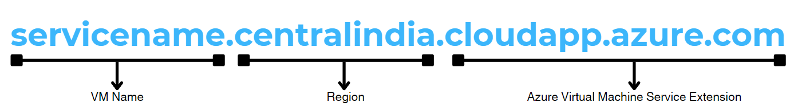
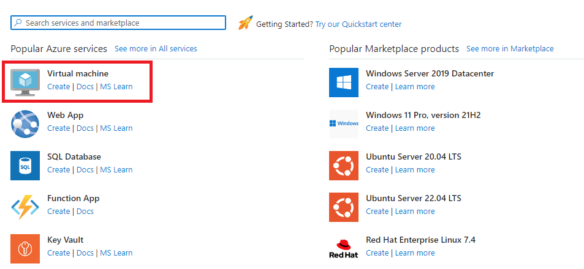
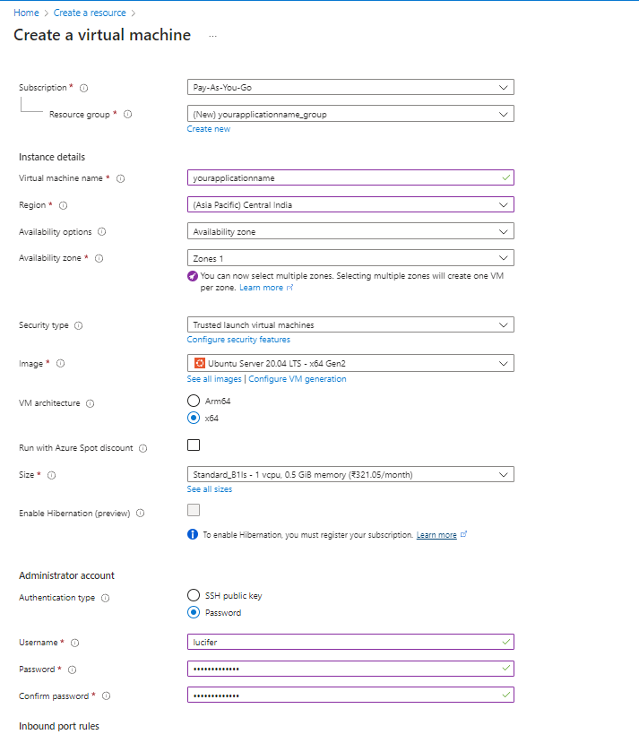
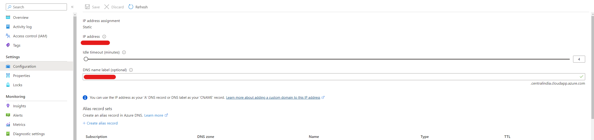
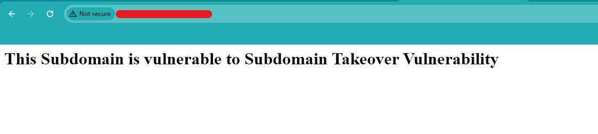

# "cloudapp.azure.com" Subdomain Takeover POC

This repo demonstrates how to takeover subdmain which is pointing to Azure Virtual Machine (cloudapp.azure.com) service.

## Description
A subdomain takeover vulnerability occurs when a subdomain (e.g., sub.example.com) of a domain points to an external service, and the ownership of that external service is lost by the original domain owner. In other words, if the external service associated with the subdomain is no longer under the control of the domain owner, it becomes susceptible to takeover by an attacker.

# Let's Takeover \*.\*.cloudapp.azure.com service

**Find potentially vulnerable subdomains:**
1. You can manually check for vulnerable subdomain using `dig` command.
2. Automate using nuclei : 

    ```
    nuclei -u subdomains.txt -t nuclei-templates/dns/azure-takeover-detection.yaml
    ```
<bt/>

**Azure Service CNAME Structure :**



**Steps:**
1. Go to https://portal.azure.com/#create/hub.
2. Click on "Create" button under Virtual Machine.
<br/>

<br/>

3. Enter the "Virtual Machine Name" same as mentioned in CNAME.
4. Select region same as CNAME.
5. Select Image to Ubuntu & Size to Standard_B1ls as its the cheapest.
6. Under Administrator account, Set Authentication type to Password & fill username & password ( Note username & password as we'll use it to ssh into the machine ).
7. Select Inbound Ports : 80, 443, 22. **[Important]**
<br/>

<br/>

8. Click Review + Create Button & the Create Button.
9. Once machine is created click go to resouce.
10. Click on Properties on left panel.
11. Click on youripaddress/\<none\>.
12. Enter VM name in DNS name label.
<br/>

<br/>

13. Click on Save.
14. Now ssh into the machine using the credentials set on step 5 & run below commands. (ssh username@IP)
<br />

```
git clone https://github.com/niteshmmgupta/cloudapp.azure.com-subdomain-takeover
cd cloudapp.azure.com-subdomain-takeover
python3 main.py
```
Visit Subdomain, Take Screenshot & Report.
<br/><br/>

